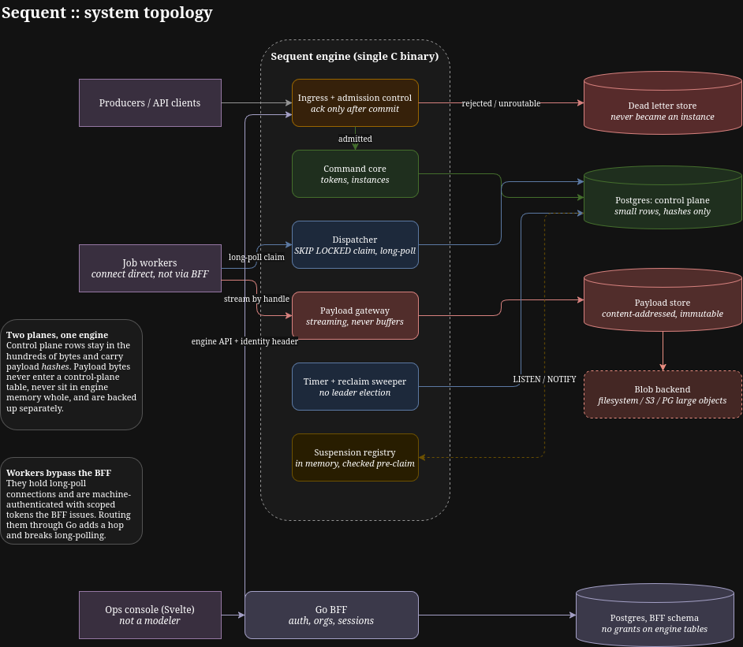

# Gentzen

After a few years running Camunda 8 in a critical Global Markets system, I got tired of fighting the same operational problems. Gentzen is my attempt to solve those problems with less machinery, fewer assumptions, and no ambitions beyond orchestration.

### Core Principles

1. **Keep it simple.**
   Gentzen should be easy to understand, install, deploy and operate. Fewer moving parts beat clever abstractions.

2. **Do not lose work.**
   Backpressure is not an excuse to drop messages. Slow down, queue them, or dead-letter them. Data loss is failure.

3. **Keep state small.**
   Orchestration state is not payload data. Large payloads belong outside the engine and should be referenced, streamed and stored separately.

4. **Do not load what you can stream.**
   A huge JSON document should not require huge amounts of RAM. Sequent moves references and streams bytes whenever possible.

5. **Recovery should be boring.**
   Engine state should be small, explicit and easy to back up. Restoring the engine should not require restoring every payload first.

6. **Pause means pause.**
   Operators must be able to stop processing without losing or rewriting work, fix the problem, then resume where they left off.

7. **Definitions are source code.**
   `.sequent` files belong in Git. They should be readable, diffable and mergeable. XML is not. Canonicalization is acceptable if it produces cleaner diffs.

8. **Do orchestration, nothing else.**
   Gentzen decides what runs next and remembers enough to recover. Workers run business logic. Gentzen is not a modeler, analytics suite, application server or low-code platform.

### Target Architecture (WIP)

